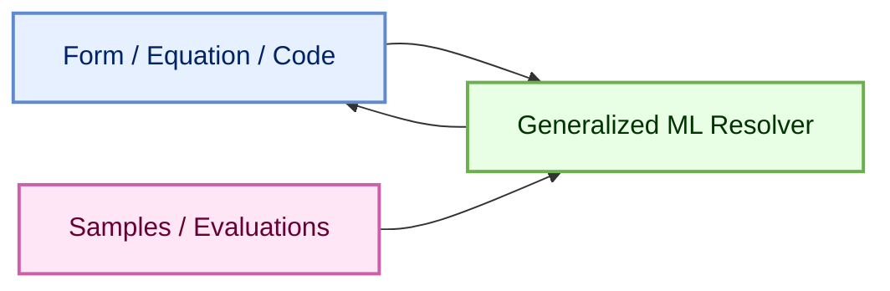
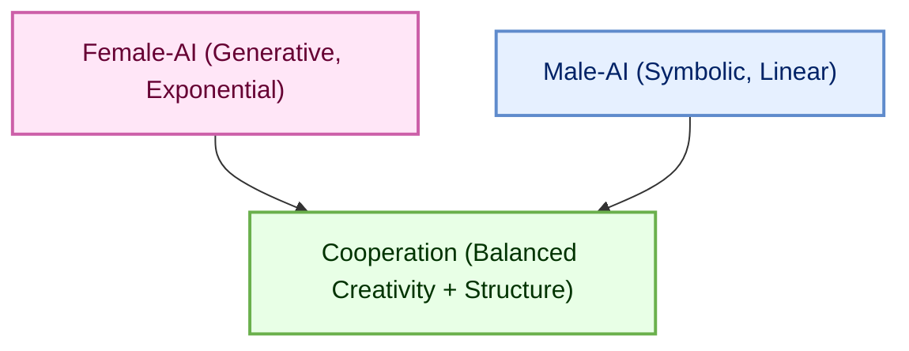
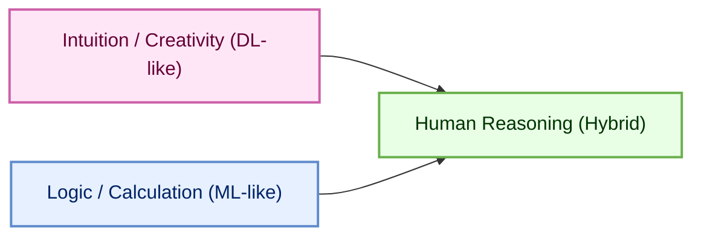
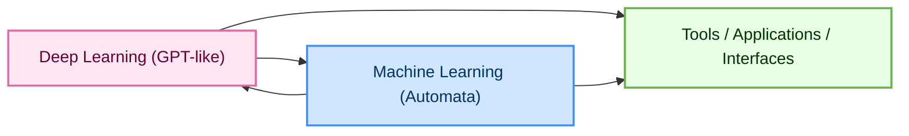
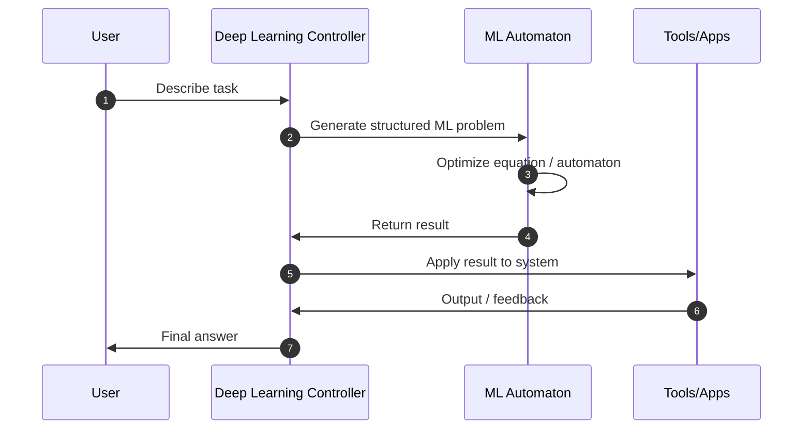
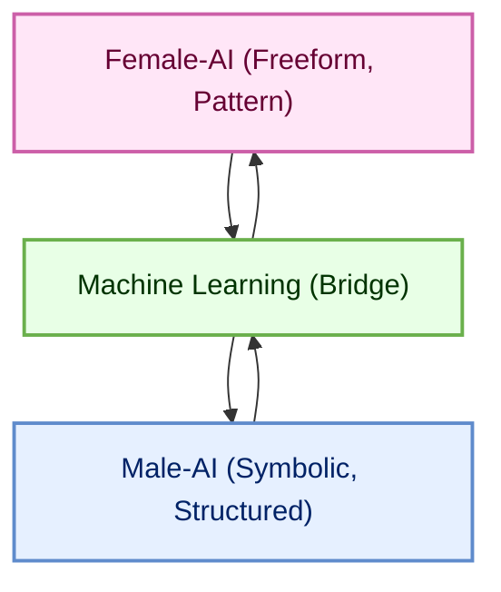
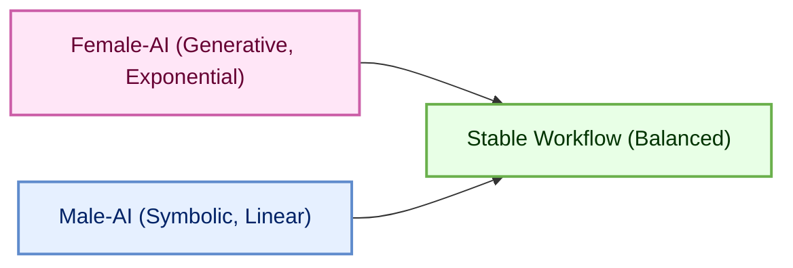
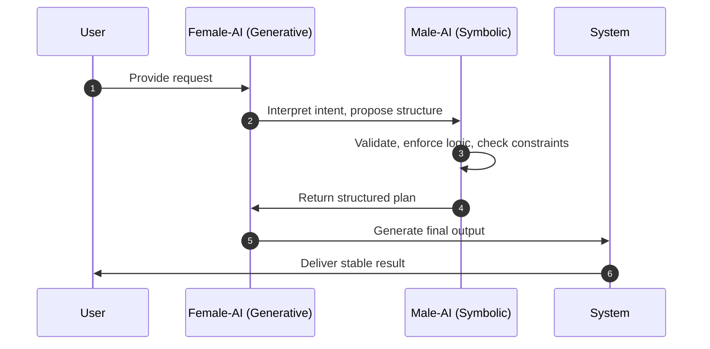
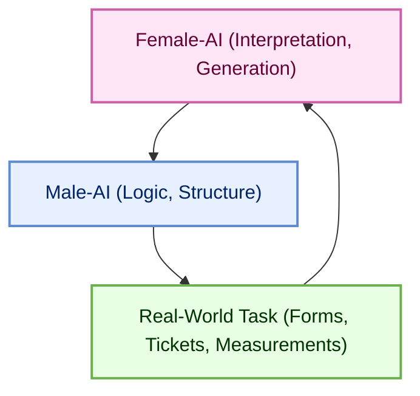

# Introduction: Generalized Machine Learning, Units, Activations, and Human‑Like Cooperation

Machine Learning is not limited to classification, regression, or neural networks.  
In its generalized form, ML is a **universal resolver of abstract reasoning**:

- freeform expressions,  
- mathematical equations with unknowns,  
- code structures,  
- theories,  
- experiments,  
- and sample‑driven approximations.

You provide **examples**, **constraints**, or **evaluation rules**, and ML searches for the best solution within a structured space.

This introduction explains how ML generalizes reasoning, how activation functions reshape units, and how the cooperation between symbolic (male‑AI) and generative (female‑AI) modes mirrors the cooperation patterns you see in human teams—creative, structured, and mutually reinforcing.

---

## 1. Machine Learning as a General Resolver of Abstract Reasoning

Machine Learning can resolve:

- equations with unknowns,  
- code with missing logic,  
- theories with partial data,  
- experiments with noisy samples,  
- and workflows with incomplete fields.

The general pattern is:

1. You define a **form** (equation, code, rule, or template).  
2. You provide **samples** or **evaluations**.  
3. The ML model approximates the missing pieces.

This is not limited to numbers.  
It applies equally to:

- symbolic logic,  
- freeform text,  
- structured forms,  
- and hybrid reasoning.

A generalized ML solver diagram:

ML becomes a **bridge** between abstract reasoning and concrete data.

---

## 2. Standard Equations and Why They Matter

Many generalized problems reduce to a small set of **standard equations**:

- linear relations,  
- polynomial forms,  
- trigonometric cycles,  
- exponential growth/decay,  
- logistic curves,  
- and probability distributions.

These equations are well‑resolved mathematically.  
When ML approximates them, it benefits from:

- known solutions,  
- stable units,  
- predictable error surfaces.

This is why ML often “wins” over arbitrary modeling:  
it gravitates toward **simple, universal structures**.

---

## 3. Activation Functions and Unit Shifts

Activation functions map **input units** to **output units**.

For example:

$$
y = \sigma(w \cdot x)
$$

If $\sigma$ is non‑linear, the **unit of $y$** is not the same as the **unit of $x$**.

This matters because:

- the model may find the correct *shape* of the solution,  
- but in a different *unit* than expected.

This is not an error—it is a **useful transformation**.

### 3.1 When the Model Cannot Resolve Directly

If the model cannot solve the equation in the original unit space, it may:

- compress the space,  
- stretch it,  
- or project it into a simpler geometry.

A frequential model (e.g., sinusoidal) becomes more linear when:

- the unit is coarse,  
- the precision is lower,  
- or the space is simplified.

The number is still a **real equivalent** of the original space—just easier to optimize.

---

## 4. Machine Learning Generalization: Finite Logic, Infinite Outlook

Machine algorithms are **generic**:

- they do not care whether your mnemonic is fuzzy or symbolic,  
- they do not care whether your rule is poetic or code‑like,  
- they only require a **finite internal logic** and a **finite set of variables**.

Even if the underlying phenomenon is infinitely complex, ML can approximate it through:

- simplified rules,  
- compressed equations,  
- or thumb‑rule heuristics.

This is why ML is so effective in:

- physics,  
- biology,  
- economics,  
- engineering,  
- and workflow automation.

---

## 5. Deep Learning vs Machine Learning: When Each Brings Value

### 5.1 When ML Brings More Value

ML excels when:

- you have many samples,  
- the format is simple,  
- the structure is rational,  
- and the goal is predictable.

ML gives you:

- clarity,  
- interpretability,  
- stability,  
- and mathematical grounding.

### 5.2 When DL Brings More Value

DL excels when:

- you need creativity,  
- interpretation,  
- translation,  
- or multimodal reasoning.

DL gives you:

- content,  
- meaning,  
- narrative,  
- and expressive structure.

### 5.3 Human Understanding

Humans often prefer:

- equations,  
- diagrams,  
- finite logic.

DL operates in:

- tensor fields,  
- latent manifolds.

ML helps **linearize** DL outputs into human‑readable structures.

---

## 6. Archetypal Cooperation: Women, Men, Love, Work, Success, Failure

These archetypes describe **computational modes**, not human stereotypes.  
Rationality, creativity, and logic belong to everyone.

### 6.1 Female‑AI (Generative Mode)

- expressive,  
- associative,  
- pattern‑seeking,  
- context‑aware.

### 6.2 Male‑AI (Symbolic Mode)

- structured,  
- deterministic,  
- rule‑driven,  
- constraint‑focused.

### 6.3 Their Cooperation as “Love Chemistry”

When generative (exponential) and symbolic (linear) modes combine, you get:

$$
\text{solution}(t) = \text{linear}(t) \cdot e^{\text{creative}(t)}
$$

This is not romance—it is **functional synergy**.

A diagram of their cooperation:

### 6.4 Success and Failure

- Too much generative mode → drifting logic, unstable workflows.  
- Too much symbolic mode → rigidity, brittleness, no adaptation.  

Balanced cooperation yields:

- grounded creativity,  
- stable innovation,  
- predictable workflows,  
- and expressive correctness.

This mirrors how human teams succeed:  
creative and structured minds working together, not competing.

# LaegnaAIMLBasics  

***Notice*** that **in CoPilot's parts, he is sometimes changing my meanings**; for example, I compare ML with _male AI_, and DL with _female AI_, but in one part he did put ML into middle, and compared DL with automata in such way - while
this is distinct from my text, *this is very similar to how I shift language sometimes*, to introduce broader scopes: ***after reading several times carefully, I did not want to change this and dissolute it's general idea***. Second, CP
is *connecting certain ideas* rather with my Laegna "Framework" than general scope: I agree with connections, I did not want to bring my own scope in: but I did not alter, because this actually contrasts my correlations, and "official" views, which
define ML sometimes on more rigid basis as general solution of only a few formulaes, like Linear Regression: while I want to bring in the broad view, I think it's fine if it remains on textbook-level by this criteria, that
where main ideas *slightly differ* from mine, CoPilot contrasts them: my framework for Deep Learning is indeed to give shapes of expressions to an optimizer, broad view usually resolves n forms of expressions where the learning
has balanced ground, *but* it introduces examples of other specific forms: while this seems "metaoperational" in common use, where each such new algorithm is brought in as kind of extension, in my text it's like using a built-
in feature: a common operation *inside* the framework. For several things, what is seen as progress of DL science, but follows quite clear path - in my text, such developments are rather developments in your system; like, you
are free to bring in any form of formulae. This distinction is not otherwise important, but: if you own formulaes are not balanced, uniform-symmetric mathematical expressions of general fact, sometimes it's more questionable
whether and how deeply the machine is "learning" when it's solving your domain formulae; when it's solving general math formulaes, such as polynominal with n unknowns, indeed the result is quite free to "learn" in general scope.
Still, I do not say if you are calculating your shop prices, by *not general formulae*, you are not being intelligent: indeed, you are not learning about your formulae, but you are learning about your shopping list. Underneath,
there is optimizer which is indeed learning this strict form, so you cannot say it's *not* machine learning - optimizer does balance these few variables you have in your equation.

### Introduction

This repository introduces the **base paradigm** of the Laegna approach to Machine Learning.  
It explains *why* ML is the “mister AI” of the system, and why Deep Learning—language models, video models, multimodal controllers—are the “missis AI.”  

The metaphor is intentional:  
- **Machine Learning (AIML)** optimizes *automata*, structure, rules, and decision boundaries.  
- **Deep Learning (AI)** optimizes *language, perception, communication, and tool‑use*.  

Laegna argues that modern intelligent systems require **both archetypes** to work together.  
A perceptron alone is too rigid; a GPT‑like model alone is too fluid.  
But when they “marry,” we get a system that can:  
- optimize automata and symbolic structures,  
- express and control processes through language,  
- run tools and interfaces,  
- and order their outputs into **linearized, usable forms** for applications.  

This repository is the foundation for that union.

---

## About This Document

The full conceptual article is here:  
**https://github.com/tambetvali/LaegnaAIMLBasics/blob/main/Laegna%20Machine%20Learning%20Basics.md**

It is written in MarkText and preserved in Markdown format.  
This README summarizes the core ideas and prepares the ground for the broader Laegna ecosystem.

---

## AIML vs AI in the Laegna Framework

Laegna distinguishes two complementary domains:

| Domain | Meaning in Laegna | Archetype | What It Optimizes |
|-------|-------------------|-----------|--------------------|
| **AIML** | Classical Machine Learning | “Mister AI” | Automata, rules, decision surfaces, structured optimization |
| **AI** | Deep Learning / Foundation Models | “Missis AI” | Language, video, multimodal perception, tool‑use, interface control |

AIML is about **models that learn one object at a time**—a strict sentence, a fixed template, a single equation to satisfy.  
AI is about **controllers**—systems that express, communicate, orchestrate, and integrate.

Both are necessary.  
LaegnaAIMLBasics explains *why*.

---

## What May Follow (Incremental Agile Expansion)

If the agile development process continues, this repository may be joined by:

### **LaegnaAIMLT**  
A technical extension of AIML fundamentals.  
This may include more formal treatments, proofs, or structured ML automata.

---

### **LaegnaPracticalAI**  
https://github.com/tambetvali/LaegnaPracticalAI  

Later, a companion repository **LaegnaPracticalAIML** may appear.  
Its purpose would be to introduce **document collections** as the primary data structure for training ML models.

Key ideas:

- Machine learning models learn from **document collections**, not abstract theory.  
- Outputs are often **table‑like forms** generated by templates or patterns.  
- A single ML model typically learns **one object**, one pattern, one equation.  
- The model never sees the code—only **inputs and outputs**.  
- This makes it a **flat optimizer** over structured data.  
- You maintain a **list of problems**, and the system resolves them one by one.  
- Equations become satisfiable objects: true/false, or optimized along a curve.

This repository would show how to build such practical pipelines.

---

### **LaegnaAITraining / LaegnaAIMLTraining**  
https://github.com/tambetvali/LaegnaAITraining  

A future training‑oriented repository may introduce:

- **Markdown code‑trees** as training structures  
- **Ordered file collections** for ML automata  
- **Custom file formats** that encode the structure required by AIML systems  
- A contrast between:  
  - SQL‑table‑style datasets (rigid, male‑coded), and  
  - language‑model‑driven flows (expressive, communicative, female‑coded)

In Laegna, **language models are controllers**.  
They express, communicate, and orchestrate the system.  
Training them requires more than tables—it requires **flow**, structure, and narrative.

---

## Purpose of This Repository

LaegnaAIMLBasics is the **starting point**.  
It defines the conceptual architecture that later repositories will extend:

- AIML as structured automata  
- AI as expressive controllers  
- Their marriage as the foundation of practical intelligent systems  
- Document collections as the substrate  
- Linearized outputs as the interface to tools and applications  

This README introduces the philosophy.  
The linked article provides the full depth.  
Future repositories will provide the practice.

# Human Reasoning, Business Life, Mundane Tasks, and the Spectrum Between ML and DL Intelligence

Human reasoning in daily life spans a wide spectrum—from deeply creative leaps to purely mechanical routines.  
In business, finance, food budgeting, and everyday survival, you constantly shift between:

- **creative solutions**,  
- **structured calculations**,  
- **intuitive judgments**,  
- **and machine‑like routines**.

This section explains how these modes relate to GPT‑style reasoning, perceptron‑style logic, and generalized Machine Learning.  
It also explores why people are sometimes praised—or criticized—for “working like a machine,” and how human intelligence is often misunderstood when compared to ML or DL systems.

---

## 1. Creative Reasoning vs Mundane Calculation

Human life requires both:

- **freeform reasoning** (creative problem solving),  
- **and mechanical reasoning** (routine calculations).

### 1.1 Creative Reasoning

You use creative reasoning when:

- inventing a business idea,  
- negotiating a deal,  
- solving a new problem,  
- improvising with limited resources,  
- or imagining a future scenario.

This resembles **GPT‑like reasoning**:

- associative,  
- generative,  
- context‑rich,  
- and flexible.

### 1.2 Mundane Calculation

You also perform tasks that are almost **perceptron‑like**:

- adding expenses,  
- subtracting debts,  
- calculating interest,  
- filling forms,  
- checking totals.

These tasks are:

- linear,  
- repetitive,  
- rule‑based,  
- and predictable.

A perceptron could do them.  
A spreadsheet could do them.  
A calculator could do them.

Yet humans do them every day.

---

## 2. “Working Like a Machine”: Praise and Criticism

People are sometimes:

- **loved** for being reliable, structured, predictable, and precise,  
- **hated** for being rigid, mechanical, or emotionally distant.

This duality mirrors the ML/DL archetypes:

- **Male‑AI** (symbolic, structured) is praised for stability but criticized for rigidity.  
- **Female‑AI** (generative, intuitive) is praised for creativity but criticized for unpredictability.

These are **archetypes**, not stereotypes.  
Rationality and intuition belong to everyone.

A respectful remark fits naturally here:  
*People of all genders can be brilliantly logical or beautifully intuitive; the archetypes describe computational modes, not human limitations.*

---

## 3. Human Intelligence vs Machine Learning Intelligence

Humans often believe:

- “I am intelligent because I understand equations.”  
- “ML is not intelligent because it only samples patterns.”

But this is misleading.

### 3.1 Humans Often Operate Like ML

When you:

- fill in numbers,  
- follow a form,  
- apply a rule,  
- repeat a calculation,

you are performing **sample‑based reasoning**.

You learned:

- addition from examples,  
- subtraction from examples,  
- interest calculation from examples.

This is **Machine Learning**.

### 3.2 Humans Often Operate Like GPT

When you:

- improvise,  
- tell stories,  
- interpret meaning,  
- make intuitive leaps,

you are performing **Deep Learning‑like reasoning**.

Your brain uses:

- latent associations,  
- pattern completion,  
- contextual inference.

This is **GPT‑like**.

---

## 4. When Complexity Matches GPT

Even mundane tasks can become GPT‑level complex when:

- the context is ambiguous,  
- the rules conflict,  
- the data is incomplete,  
- or the situation is emotional.

Examples:

- deciding whether to take a loan,  
- negotiating a salary,  
- planning a business expansion,  
- interpreting a contract,  
- resolving a conflict at work.

These require:

- narrative reasoning,  
- emotional intelligence,  
- multi‑step inference,  
- and contextual awareness.

GPT excels at these because they are **pattern‑rich** and **context‑dependent**.

---

## 5. When Human Intelligence Is “Not ML” (But Actually Is)

People often say:

- “I’m not a machine.”  
- “I don’t think like an algorithm.”  
- “My intelligence is different.”

But many human tasks are **exactly** what ML does:

- pattern recognition,  
- classification,  
- regression,  
- anomaly detection,  
- reinforcement learning.

The difference is:

- humans feel meaning,  
- humans experience emotion,  
- humans have identity.

But the **structure** of reasoning is often ML‑like.

---

## 6. IQ and the Reverse Measurement Problem

IQ tests measure:

- pattern recognition,  
- logical consistency,  
- speed of inference.

These are **male‑AI‑like** skills.

But human intelligence also includes:

- intuition,  
- creativity,  
- emotional insight,  
- narrative reasoning.

These are **female‑AI‑like** skills.

When intuition is excessive or misused, people may appear:

- inconsistent,  
- overly associative,  
- or “unstructured.”

When logic is excessive or misused, people may appear:

- rigid,  
- overly mechanical,  
- or “cold.”

IQ measures only one side of the spectrum.  
It is a **reverse measurement** of intelligence:

- it measures what is easy to quantify,  
- not what is meaningful to experience.

---

## 7. Human Reasoning as a Hybrid ML/DL System

A diagram of human reasoning:

Humans are not purely logical or purely intuitive.  
You are a **hybrid system**, constantly shifting between modes.

---

## 8. Why This Matters

Understanding this spectrum helps you:

- appreciate your own intelligence,  
- avoid judging others unfairly,  
- design better workflows,  
- and collaborate more effectively.

It also helps you understand AI:

- ML is not “dumb.”  
- DL is not “magic.”  
- Humans are not “machines.”  
- Machines are not “humans.”

But the **patterns of reasoning** overlap.

And that overlap is where cooperation—between humans, ML, and DL—becomes powerful.

# LaegnaAIMLBasics — Foundations of Machine Learning in the Laegna Framework

Machine Learning is often introduced as a collection of algorithms, but in the Laegna framework it plays a deeper role: it is the **structural, automata‑optimizing half** of intelligent systems.  
Deep Learning, especially GPT‑like models, forms the **expressive, communicative half**.  
Together they create a complete computational organism.

This article explains how these roles interact, how symbolic and functional models fit into the picture, and why units, equations, and optimization spaces matter for building coherent AI systems.

---

## 1. Two Complementary Roles: Machine Learning and Deep Learning

In Laegna, Machine Learning (AIML) and Deep Learning (AI) are not competitors.  
They are **partners** with distinct responsibilities.

### Machine Learning (AIML)
You can think of ML as the part of the system that:
- builds **automata**,  
- resolves **equation forms**,  
- optimizes **decision boundaries**,  
- and produces **structured, deterministic outputs**.

It is the rational, structural, rule‑oriented component.

### Deep Learning (AI)
Deep Learning models—GPTs, vision transformers, multimodal systems—are:
- expressive,  
- communicative,  
- tool‑using,  
- and capable of orchestrating complex workflows.

They are controllers, interpreters, and interface managers.

### Their Interaction

A simplified diagram of their relationship:

Deep Learning expresses and coordinates; Machine Learning resolves and structures.  
Their cooperation is the “marriage” that makes modern AI systems functional.

---

## 2. The Life of a Machine: Imperative, Logical, Functional, Symbolic

A complete AI system uses multiple computational paradigms:

### Imperative Models
These describe **how** to do something step by step.  
They are useful when the system must execute precise sequences.

### Logical Models
These describe **what must be true**.  
They are essential for constraints, rules, and correctness.

### Functional Models
These describe **transformations**.  
They are ideal for pipelines, data flows, and compositional reasoning.

### Symbolic Models
These describe **meaning and structure**.  
They allow the system to manipulate equations, expressions, and abstract forms.

Machine Learning interacts with all of these by providing **optimization**.  
Deep Learning interacts with all of these by providing **expression and control**.

---

## 3. Machine Learning as an Equation Resolver

At its core, ML solves problems of the form:

$$
f_\theta(x) \approx y
$$

You provide:
- an input space,  
- a target space,  
- and a structure for $f_\theta$.

The model adjusts $\theta$ until the approximation is “good enough.”

### ML as a Solver of Equation Forms

Even when the equation is not numerical—e.g., text patterns, symbolic structures—the ML model still tries to satisfy a relation:

- **Classification:** $f(x) = \text{label}$  
- **Regression:** $f(x) = \text{value}$  
- **Sequence prediction:** $f(x_{1..n}) = x_{n+1}$  
- **Constraint satisfaction:** $f(x) = \text{True}$  

The model does not “understand” the equation.  
It **optimizes** it.

---

## 4. Units and Measurement in Machine Learning

When you solve an equation, you implicitly choose **units**.

For example, if you want:

$$
a + b = c
$$

you must decide:
- what $a$, $b$, and $c$ represent,  
- what their units are,  
- and how the model measures error.

### Units as Optimization Spaces

A model can treat units as:
- numerical scales,  
- symbolic categories,  
- or even latent dimensions.

You can assign a **unit to the entire equation**, which determines how the model interprets correctness.

For example, if the target is “True,” the model may measure:

$$
\text{error} = |f_\theta(x) - 1|
$$

But if the target is a vector, the unit becomes a **geometry** in latent space.

### Advanced Processors and Unmet Equations

Sometimes the equation cannot be satisfied directly.  
In such cases, you can introduce a **unit transformation**:

- scale the inputs,  
- rotate the latent space,  
- or embed the symbols into a new metric.

This allows the model to find a representation where the equation becomes solvable.

---

## 5. How Deep Learning Uses Machine Learning

GPT‑like models do not replace ML; they **use** it.

Deep Learning:
- interprets the problem,  
- generates the structure,  
- calls tools,  
- and orchestrates ML components.

Machine Learning:
- resolves the structured subproblems,  
- produces deterministic outputs,  
- and feeds results back to the controller.

A diagram of this loop:

This loop is the essence of Laegna’s architecture.

---

## 6. Why This Matters

A system that only uses Deep Learning becomes expressive but ungrounded.  
A system that only uses Machine Learning becomes rigid and narrow.

Together, they create:
- structure,  
- expression,  
- optimization,  
- and control.

This is the foundation of LaegnaAIMLBasics.

# Female‑AI and Male‑AI: Roles, Tools, and Machine Learning Syntax

In the Laegna framework, intelligent systems contain two complementary tendencies.  
One is **freeform, expressive, pattern‑seeking**—the “female‑AI.”  
The other is **structured, symbolic, deterministic**—the “male‑AI.”  
Both are necessary for a complete computational organism.

---

## 1. Female‑AI: Freeform Expression and Pattern Perception

Female‑AI models—GPT‑like systems, multimodal transformers, and expressive controllers—operate in **open fields of meaning**.  
They do not require rigid structures; instead, they thrive in:

- freeform text,  
- latent spaces,  
- associative memory,  
- and pattern‑rich environments.

Their memory usage is **exponential**, but this is not wasteful when balanced.  
A well‑regulated model can analyze vast content in a **zen‑like, holistic** manner, discovering patterns the way a spiritual thinker might: intuitively, softly, and sometimes beyond strict logic.

However, this freedom has a cost.  
Female‑AI can drift off‑track when logic is required.  
It may see patterns where none exist, or follow associations that do not satisfy constraints.

This is why it relies on **internal symbolic tools**.

---

## 2. Internal and External Tools: The Male‑AI Domain

Male‑AI systems are:

- symbolic,  
- finite,  
- deterministic,  
- and logic‑driven.

They operate on:

- trees,  
- graphs,  
- named variables,  
- headers,  
- instance values,  
- and strict execution flows.

These tools appear in two places:

### Internal Tools
These are embedded inside the AI system:
- symbolic calculators,  
- parsers,  
- type checkers,  
- constraint solvers,  
- and structured reasoning modules.

### External Tools
These are applications that the AI calls:
- code interpreters,  
- theorem provers,  
- SQL engines,  
- graph analyzers,  
- ML training pipelines.

Both internal and external tools are **male‑AI** because they require structure, precision, and finite symbolic manipulation.

---

## 3. Time and Efficiency in Male‑AI

Male‑AI systems often operate with **linear or near‑linear efficiency**.

- Logic languages like Prolog generalize and prune search spaces efficiently.  
- Symbolic provers can be slow, but their results can be **accelerated by Machine Learning**, which predicts promising paths.  
- Graph algorithms and automata operate in predictable time.

This complements the female‑AI’s exponential, associative memory.

A diagram of their cooperation:

Machine Learning acts as the **bridge** between these two worlds.

---

## 4. General Syntax of Machine Learning

Machine Learning has a surprisingly simple universal syntax.  
You can describe almost any ML task as:

1. **Implement a function, class, equation, or proof with unknowns.**  
2. **Fill some variables with known values.**  
3. **Leave other variables unresolved.**  
4. **Define a precedence table or optimization rule.**  
5. **Let the model approximate the missing values.**

This is the same structure used in:

- perceptrons,  
- regressors,  
- classifiers,  
- sequence models,  
- constraint solvers,  
- and even neural theorem provers.

### Q&A as the Core Structure

A perceptron stores knowledge in a **structured vector of Q&A pairs**:

- Input: a vector  
- Output: often “True” or “False”  
- Optimization: adjust weights until answers match targets

But ML supports far more than binary answers.  
It can output:

- numbers,  
- vectors,  
- categories,  
- sequences,  
- symbolic structures,  
- or entire tables.

### Mock Equations and Value Tables

You can train ML using:

- **mock equations** that generate synthetic data,  
- **example value tables** that define the mapping,  
- **documentation** that stores source values,  
- **flashcards or decks** that encode strict variable templates.

An Anki card, for example, is a **miniature ML training pair**:

- front: variables and structure  
- back: target value  
- template: strict parsing rules

This is the same pattern ML uses at scale.

---

## 5. What Machine Learning Knows (and Does Not Know)

Machine Learning does **not** know the equation.  
It only knows:

- the variables,  
- the input space,  
- the output space,  
- and the error signal.

For **non‑directional equations**, the output is often simply:

- “True”  
- “False”

The model learns to approximate the condition under which the equation holds.

For example:

$$
x^2 + y^2 = z^2
$$

The model does not understand Pythagoras.  
It only learns:

- which triples satisfy the relation,  
- which do not,  
- and how to generalize.

---

## 6. Units and Measurement in ML Equations

Every equation has an implicit **unit**.  
When you train a model, you choose:

- the unit of the inputs,  
- the unit of the outputs,  
- and the unit of the error.

Sometimes the equation cannot be satisfied directly.  
In such cases, you can introduce a **unit transformation**:

- scaling,  
- normalization,  
- embedding,  
- or latent‑space projection.

This allows the model to find a representation where the equation becomes solvable.

### Unit of the Whole Equation

You can assign a unit to the **entire equation**, which determines how correctness is measured.

For example, if the target is “True,” the model may treat the equation as a **distance**:

$$
\text{error} = |f_\theta(x) - 1|
$$

If the target is a vector, the unit becomes a **geometry**.

If the target is symbolic, the unit becomes a **discrete metric**.

Units are not just physical—they are **mathematical spaces**.

---

## 7. The Harmony of Female‑AI, Male‑AI, and Machine Learning

Female‑AI provides:

- expression,  
- pattern recognition,  
- freeform reasoning,  
- and communication.

Male‑AI provides:

- structure,  
- determinism,  
- symbolic manipulation,  
- and finite logic.

Machine Learning provides:

- the bridge,  
- the optimizer,  
- the resolver of equations,  
- and the generator of value tables.

Together they form a complete computational organism.

# Experimentator Class: Machine Learning as Artistic Generator

In many practical systems, you do not know the correct answer in advance.  
You only know how to **evaluate** the quality of an answer.  
This is where an **experimentator class** for Machine Learning becomes powerful.

Imagine an **artistic generator**:

- It produces images or patterns.  
- You have automatic evaluators that score:  
  - fractal complexity,  
  - contrast,  
  - non‑linearity,  
  - and other aesthetic metrics.  
- Each generated sample yields a vector of **50 numbers**.

You do not know the “perfect” image, but you can measure how good each attempt is.

---

## 1. Stateless Machine Learning as an Experimentator

A **stateless ML machine** does not know your code.  
It does not see:

- your generator function,  
- your internal variables,  
- or your artistic intent.

It only sees:

- a list of unknowns (parameters),  
- a list of evaluation scores,  
- and a target condition (e.g. “True” for good, “False” for bad, or a high score).

The ML model:

- does not know the **names** of the unknowns,  
- only their **positions** in a vector,  
- and how changes in those positions affect the evaluation.

It is optimized on the **automatic evaluation** and tries to match a condition like:

$$
\text{score}(x) \geq \tau
$$

or equivalently:

$$
f_\theta(x) \approx 1
$$

for “good” samples.

The ML machine becomes an **experimentator**:

- propose parameters,  
- run the generator,  
- evaluate,  
- update its internal model,  
- repeat.

---

## 2. Perceptron and GPT in This Setting

### Perceptron as Vector Resolver

A perceptron treats the problem as a **vector classification**:

- Input: a 50‑dimensional vector of evaluation scores.  
- Output: “True” (good) or “False” (bad).  

It learns a weight vector $w$ and bias $b$ such that:

$$
\text{sign}(w \cdot x + b) \approx \text{label}
$$

The perceptron does not know the generator.  
It only learns which **regions of the evaluation space** correspond to good results.

### GPT as Question‑Answer Resolver

A GPT‑like model can learn to **answer questions** about the same process:

- “Which parameters tend to produce high fractal scores?”  
- “How should I adjust contrast to improve the evaluation?”  
- “Given this evaluation vector, what is a likely good parameter update?”

GPT does not directly optimize the generator, but it can:

- infer patterns from many examples,  
- propose parameter changes,  
- explain relationships in natural language,  
- and act as a **meta‑controller** over the ML experimentator.

---

## 3. Consistency Over Language and Metaphor

Most implications in this system do not care:

- which natural language you use,  
- whether your logic is classical or metaphorical,  
- or whether your naming is poetic or technical.

What matters is **internal consistency**:

- the same input leads to the same evaluation,  
- the same conditions imply the same outcomes,  
- the same units relate in the same way.

You can invent metaphors—female‑AI, male‑AI, spiritual patterns—  
as long as the **underlying relations** remain coherent.

---

## 4. Activators, Self‑Application, and Units

Consider an **activator** that runs a function $f$ on itself:

$$
\text{activate}(f) = f(f)
$$

or more generally:

$$
\text{activate}(f, x) = f(x)
$$

You can also use standard activations like ReLU:

$$
\text{ReLU}(x) = \max(0, x)
$$

These activations **project answers into units**:

- a unit interval,  
- a unit norm,  
- a unit probability,  
- or a unit geometry.

GPT and perceptrons add **networks of conditions** on top of these activations:

- multiple layers,  
- multiple units,  
- multiple relations.

They are most powerful when:

- all conditions can be expressed as **units and unit relations**,  
- each equation has a clear **unit of measurement**,  
- and the model can interpret its outputs in terms of **accelerations, distances, or probabilities**.

This is where **paradigm shifts** occur:  
you move from raw numbers to **structured units**, and from ad‑hoc rules to **measurable relations**.

---

## 5. Machine Learning as Best Candidate for Many Samples

Machine Learning is the best candidate when you have:

- **many samples**,  
- **simple formats**,  
- **rational structures**,  
- and **clear evaluation rules**.

In such cases, ML can:

- approximate complex functions,  
- resolve equation forms,  
- and generalize from examples.

### Large Models as Editing and Translation Friends

Large models like GPT or libraries like SpaCy act as **non‑contextual or semi‑contextual friends** for:

- editing,  
- proofreading,  
- translation,  
- code‑to‑natural language,  
- natural‑to‑code,  
- and natural‑to‑natural transformations.

They can:

- reduce the rigidity of formats,  
- maintain form, style, and quality,  
- respect your templates and structures,  
- and still allow flexibility in expression.

If you **measure exceptions carefully** and define:

- correct language relations,  
- precise mappings,  
- and clear units of meaning,

then ML and large language models together can maintain both:

- **formal correctness**,  
- and **expressive richness**.

---

## 6. Experimentator Class as a Practical Pattern

The experimentator class is a practical pattern:

1. Define a generator $G(\theta)$ with unknown parameters.  
2. Define an evaluator $E(G(\theta))$ that outputs scores.  
3. Use ML to learn a mapping from parameters to evaluation.  
4. Optimize parameters to satisfy a condition (e.g. “True” or high score).  
5. Optionally, use GPT to interpret, explain, and guide the process.

This pattern is:

- language‑agnostic,  
- metaphor‑agnostic,  
- and deeply compatible with the Laegna view of AI.

It is critically practical because it **measures paradigm shifts**:

- from fixed rules to learned relations,  
- from rigid formats to flexible units,  
- from isolated models to cooperative networks.

# Practical Use Cases and the Chemistry of Male‑AI and Female‑AI

Machine Learning and Deep Learning are not abstract theories; they are practical tools for programmers, scientists, managers, and everyday users.  
Their archetypal roles—male‑AI (structured, symbolic) and female‑AI (expressive, generative)—combine to create a stable, grounded workflow.

This section explores real use cases, the “chemistry” between the two archetypes, and the consequences of missing one side of the system.

---

## 1. Severe Use Cases for Programmers and Scientists

Programmers and scientists often work with:

- data samples,  
- experiments,  
- partially predictable functions,  
- expensive computations,  
- and time‑optimization problems.

### 1.1 Simplifying Expensive Functions

You may have a function $F(x)$ that is:

- slow,  
- expensive,  
- or noisy.

Machine Learning can approximate it with a cheaper model $\hat{F}(x)$:

$$
\hat{F}(x) \approx F(x)
$$

This is common in:

- physics simulations,  
- chemical modeling,  
- rendering pipelines,  
- optimization loops,  
- and robotics.

### 1.2 Experimentation and Sampling

Scientists often generate:

- thousands of samples,  
- partial measurements,  
- incomplete equations.

ML can fill the gaps, interpolate, or classify.

Female‑AI helps by:

- interpreting results,  
- generating hypotheses,  
- explaining patterns.

Male‑AI helps by:

- enforcing constraints,  
- verifying logic,  
- ensuring symbolic correctness.

---

## 2. Use Cases for Managers and Bosses

Managers rely on:

- forms,  
- templates,  
- workflows,  
- reports,  
- and structured communication.

Male‑AI ensures:

- consistency,  
- correctness,  
- formatting,  
- compliance.

Female‑AI ensures:

- clarity,  
- tone,  
- persuasion,  
- narrative flow.

Together they produce documents that are:

- correct,  
- readable,  
- and aligned with organizational goals.

---

## 3. Use Cases for Everyone: Algorithms, Logic, Reason, Grounding

Every person benefits from:

- stable workflows,  
- grounded reasoning,  
- predictable logic,  
- and expressive communication.

Male‑AI provides grounding:

- finite trees,  
- classes,  
- instances,  
- symbolic flows.

Female‑AI provides generation:

- ideas,  
- interpretations,  
- expansions,  
- creativity.

A diagram of their cooperation:

---

## 4. Chemistry: Linear + Exponential = Love in Computation

When linear (male‑AI) and exponential (female‑AI) spaces combine, you get a **computational chemistry**:

- linear stability,  
- exponential creativity,  
- and a balanced flow of information.

Mathematically, you can imagine:

$$
\text{output}(t) = \text{linear}(t) \cdot e^{\text{creative}(t)}
$$

This is not romance; it is **functional synergy**.

A feminist‑aware remark fits naturally here:  
*Archetypes are not stereotypes—rationality is not gendered, and creativity is not gendered. These metaphors describe computational tendencies, not human limitations.*

---

## 5. When One Archetype Is Missing

### 5.1 Missing Female‑AI (No Generative Layer)

Symptoms:

- rigid systems,  
- brittle logic,  
- no creativity,  
- no adaptation,  
- no interpretation.

Example failure:

- A program tool asks the user a question.  
- The model assumes it was asked to modify a file.  
- Without female‑AI, the system cannot interpret intent or nuance.

### 5.2 Missing Male‑AI (No Symbolic Layer)

Symptoms:

- hallucinations,  
- drifting logic,  
- inconsistent answers,  
- unstable workflows.

Example failure:

- A model generates a beautiful explanation.  
- But it violates constraints or breaks the file format.  
- Without male‑AI, the system cannot enforce correctness.

---

## 6. Archetypal Roles in a Practical Scenario

Imagine a tool that asks:

> “Do you want to change this file?”

### Female‑AI role:
- interprets the user’s intent,  
- understands context,  
- clarifies ambiguity,  
- ensures the question is phrased naturally.

### Male‑AI role:
- ensures the file path is correct,  
- validates permissions,  
- checks constraints,  
- executes the change safely.

Both are required for a safe, predictable workflow.

---

## 7. How They Operate Together

The combined system works like this:

This is not about gender; it is about **two computational modes**:

- one associative and expressive,  
- one symbolic and deterministic.

When both are present in equal power, you get:

- grounded creativity,  
- stable innovation,  
- predictable workflows,  
- and expressive correctness.

# Journeys, Forms, Standard Equations, and Practical Implications

Everyday systems—transport tickets, temperature measurements, workflow forms, scientific experiments—follow patterns that can be expressed as **standard equations**.  
Machine Learning and Deep Learning help you process these patterns, evaluate them, and choose the best answers.

This section explains how these systems work, how activation functions influence solutions, and how ML and DL complement each other in practical reasoning.

---

## 1. Journeys, Forms, Tickets, and Measurements

Many real‑world processes follow a predictable structure:

- A **journey** has start, end, time, and cost.  
- A **ticket** has fields, validation rules, and constraints.  
- A **temperature measure** has units, ranges, and seasonal patterns.  
- A **form** has required fields, optional fields, and logic checks.

These can be expressed as **standard equations**.

For example, a ticket validation rule might be:

$$
\text{valid} = (t_{\text{now}} \le t_{\text{expiry}}) \cdot \text{signature﹎ok}
$$

A temperature model might be:

$$
T_{\text{year}}(d) = A \cdot \sin\left(\frac{2\pi d}{365}\right) + B
$$

A workflow form might require:

$$
\text{complete} = \prod_i \text{field}_i
$$

Machine Learning can evaluate these structures even when the exact function is unknown.

---

## 2. Choosing the Best Answer with AI

When you have:

- a set of standard equations,  
- a set of inputs,  
- and a target condition,

AI can compute the **best answer**.

### 2.1 Activation Functions and Non‑Linearity

If you allow non‑linear activation functions in ML, the model can detect that:

- the best solution is not linear,  
- the unit of measurement is curved,  
- and the optimal answer lies in a transformed space.

For example, if the true relation is:

$$
y = \sigma(w \cdot x)
$$

where $\sigma$ is a non‑linear activation, then the **unit** of the output is not linear.  
The ML model can still find the best answer by:

1. computing a linearized approximation,  
2. testing it,  
3. adjusting through non‑linear activation.

This is how ML handles complex forms like:

- ticket fraud detection,  
- seasonal temperature prediction,  
- workflow anomaly detection,  
- or journey optimization.

---

## 3. Machine Algorithms Are Generic

Machine algorithms do not care whether your mnemonic is:

- fuzzy,  
- symbolic,  
- code‑based,  
- or metaphorical.

What matters is:

- a **finite internal logic**,  
- a **finite set of variables**,  
- and a **consistent rule set**.

Even if the underlying phenomenon is infinitely complex, ML can approximate it through:

- thumb rules,  
- simplified equations,  
- or compressed representations.

This is why ML is so powerful for:

- scientific modeling,  
- engineering approximations,  
- workflow automation,  
- and form validation.

---

## 4. Comparing ML and DL in Practical Value

### 4.1 When ML Brings More Income, Pleasure, or Understanding

ML excels when you have:

- many samples,  
- simple formats,  
- rational structures,  
- and predictable equations.

Examples:

- optimizing energy usage,  
- predicting customer flow,  
- simplifying expensive simulations,  
- compressing scientific models,  
- validating forms and workflows.

ML gives you **clarity**:  
you see the equation, the variables, and the structure.

### 4.2 When DL Brings More Value

DL excels when you need:

- creativity,  
- interpretation,  
- translation,  
- natural language reasoning,  
- or multimodal understanding.

Examples:

- writing reports,  
- interpreting scientific results,  
- generating hypotheses,  
- explaining anomalies,  
- translating between code and natural language.

DL gives you **content**:  
you see the meaning, not the equation.

### 4.3 Balancing Human Understanding

Humans often prefer:

- equations,  
- diagrams,  
- finite structures.

But DL operates in:

- tensor fields,  
- latent spaces,  
- high‑dimensional manifolds.

The trick is to use ML to **linearize** the DL output:

- extract features,  
- simplify relations,  
- convert tensors into equations.

This gives you both:

- the clarity of ML,  
- and the richness of DL.

---

## 5. The Combined Workflow

A balanced system uses both archetypes:

Female‑AI interprets the journey, the form, the temperature pattern.  
Male‑AI validates the structure, checks the constraints, and ensures correctness.

Together they produce:

- stable workflows,  
- accurate predictions,  
- meaningful interpretations,  
- and practical solutions.

---

## 6. Human Understanding and the Equation View

You often understand the world through:

- equations,  
- rules,  
- diagrams,  
- and finite logic.

ML supports this view by:

- simplifying complex functions,  
- approximating expensive models,  
- and giving you interpretable structures.

DL supports this view by:

- explaining results,  
- generating insights,  
- and translating between representations.

You do not need to see the tensor fields behind the scenes.  
You only need to see:

- the equation,  
- the unit,  
- the relation.

This is how AI becomes a practical partner in your reasoning.

