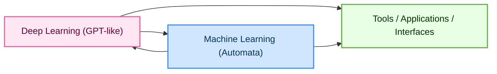
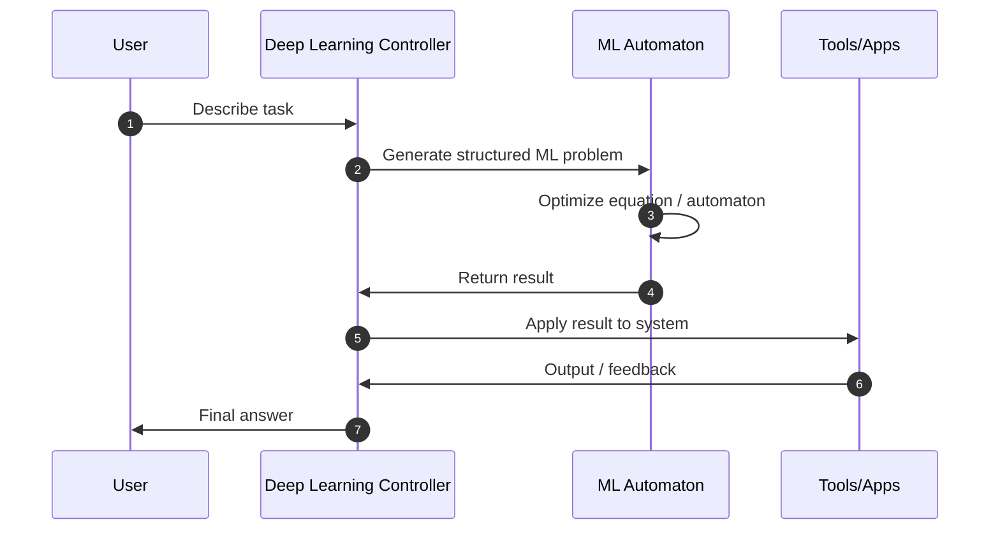
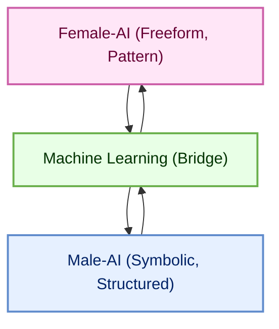

# LaegnaAIMLBasics  
### Introduction

This repository introduces the **base paradigm** of the Laegna approach to Machine Learning.  
It explains *why* ML is the “mister AI” of the system, and why Deep Learning—language models, video models, multimodal controllers—are the “missis AI.”  

The metaphor is intentional:  
- **Machine Learning (AIML)** optimizes *automata*, structure, rules, and decision boundaries.  
- **Deep Learning (AI)** optimizes *language, perception, communication, and tool‑use*.  

Laegna argues that modern intelligent systems require **both archetypes** to work together.  
A perceptron alone is too rigid; a GPT‑like model alone is too fluid.  
But when they “marry,” we get a system that can:  
- optimize automata and symbolic structures,  
- express and control processes through language,  
- run tools and interfaces,  
- and order their outputs into **linearized, usable forms** for applications.  

This repository is the foundation for that union.

---

## About This Document

The full conceptual article is here:  
**https://github.com/tambetvali/LaegnaAIMLBasics/blob/main/Laegna%20Machine%20Learning%20Basics.md**

It is written in MarkText and preserved in Markdown format.  
This README summarizes the core ideas and prepares the ground for the broader Laegna ecosystem.

---

## AIML vs AI in the Laegna Framework

Laegna distinguishes two complementary domains:

| Domain | Meaning in Laegna | Archetype | What It Optimizes |
|-------|-------------------|-----------|--------------------|
| **AIML** | Classical Machine Learning | “Mister AI” | Automata, rules, decision surfaces, structured optimization |
| **AI** | Deep Learning / Foundation Models | “Missis AI” | Language, video, multimodal perception, tool‑use, interface control |

AIML is about **models that learn one object at a time**—a strict sentence, a fixed template, a single equation to satisfy.  
AI is about **controllers**—systems that express, communicate, orchestrate, and integrate.

Both are necessary.  
LaegnaAIMLBasics explains *why*.

---

## What May Follow (Incremental Agile Expansion)

If the agile development process continues, this repository may be joined by:

### **LaegnaAIMLT**  
A technical extension of AIML fundamentals.  
This may include more formal treatments, proofs, or structured ML automata.

---

### **LaegnaPracticalAI**  
https://github.com/tambetvali/LaegnaPracticalAI  

Later, a companion repository **LaegnaPracticalAIML** may appear.  
Its purpose would be to introduce **document collections** as the primary data structure for training ML models.

Key ideas:

- Machine learning models learn from **document collections**, not abstract theory.  
- Outputs are often **table‑like forms** generated by templates or patterns.  
- A single ML model typically learns **one object**, one pattern, one equation.  
- The model never sees the code—only **inputs and outputs**.  
- This makes it a **flat optimizer** over structured data.  
- You maintain a **list of problems**, and the system resolves them one by one.  
- Equations become satisfiable objects: true/false, or optimized along a curve.

This repository would show how to build such practical pipelines.

---

### **LaegnaAITraining / LaegnaAIMLTraining**  
https://github.com/tambetvali/LaegnaAITraining  

A future training‑oriented repository may introduce:

- **Markdown code‑trees** as training structures  
- **Ordered file collections** for ML automata  
- **Custom file formats** that encode the structure required by AIML systems  
- A contrast between:  
  - SQL‑table‑style datasets (rigid, male‑coded), and  
  - language‑model‑driven flows (expressive, communicative, female‑coded)

In Laegna, **language models are controllers**.  
They express, communicate, and orchestrate the system.  
Training them requires more than tables—it requires **flow**, structure, and narrative.

---

## Purpose of This Repository

LaegnaAIMLBasics is the **starting point**.  
It defines the conceptual architecture that later repositories will extend:

- AIML as structured automata  
- AI as expressive controllers  
- Their marriage as the foundation of practical intelligent systems  
- Document collections as the substrate  
- Linearized outputs as the interface to tools and applications  

This README introduces the philosophy.  
The linked article provides the full depth.  
Future repositories will provide the practice.

# LaegnaAIMLBasics — Foundations of Machine Learning in the Laegna Framework

Machine Learning is often introduced as a collection of algorithms, but in the Laegna framework it plays a deeper role: it is the **structural, automata‑optimizing half** of intelligent systems.  
Deep Learning, especially GPT‑like models, forms the **expressive, communicative half**.  
Together they create a complete computational organism.

This article explains how these roles interact, how symbolic and functional models fit into the picture, and why units, equations, and optimization spaces matter for building coherent AI systems.

---

## 1. Two Complementary Roles: Machine Learning and Deep Learning

In Laegna, Machine Learning (AIML) and Deep Learning (AI) are not competitors.  
They are **partners** with distinct responsibilities.

### Machine Learning (AIML)
You can think of ML as the part of the system that:
- builds **automata**,  
- resolves **equation forms**,  
- optimizes **decision boundaries**,  
- and produces **structured, deterministic outputs**.

It is the rational, structural, rule‑oriented component.

### Deep Learning (AI)
Deep Learning models—GPTs, vision transformers, multimodal systems—are:
- expressive,  
- communicative,  
- tool‑using,  
- and capable of orchestrating complex workflows.

They are controllers, interpreters, and interface managers.

### Their Interaction

A simplified diagram of their relationship:

Deep Learning expresses and coordinates; Machine Learning resolves and structures.  
Their cooperation is the “marriage” that makes modern AI systems functional.

---

## 2. The Life of a Machine: Imperative, Logical, Functional, Symbolic

A complete AI system uses multiple computational paradigms:

### Imperative Models
These describe **how** to do something step by step.  
They are useful when the system must execute precise sequences.

### Logical Models
These describe **what must be true**.  
They are essential for constraints, rules, and correctness.

### Functional Models
These describe **transformations**.  
They are ideal for pipelines, data flows, and compositional reasoning.

### Symbolic Models
These describe **meaning and structure**.  
They allow the system to manipulate equations, expressions, and abstract forms.

Machine Learning interacts with all of these by providing **optimization**.  
Deep Learning interacts with all of these by providing **expression and control**.

---

## 3. Machine Learning as an Equation Resolver

At its core, ML solves problems of the form:

$$
f_\theta(x) \approx y
$$

You provide:
- an input space,  
- a target space,  
- and a structure for $f_\theta$.

The model adjusts $\theta$ until the approximation is “good enough.”

### ML as a Solver of Equation Forms

Even when the equation is not numerical—e.g., text patterns, symbolic structures—the ML model still tries to satisfy a relation:

- **Classification:** $f(x) = \text{label}$  
- **Regression:** $f(x) = \text{value}$  
- **Sequence prediction:** $f(x_{1..n}) = x_{n+1}$  
- **Constraint satisfaction:** $f(x) = \text{True}$  

The model does not “understand” the equation.  
It **optimizes** it.

---

## 4. Units and Measurement in Machine Learning

When you solve an equation, you implicitly choose **units**.

For example, if you want:

$$
a + b = c
$$

you must decide:
- what $a$, $b$, and $c$ represent,  
- what their units are,  
- and how the model measures error.

### Units as Optimization Spaces

A model can treat units as:
- numerical scales,  
- symbolic categories,  
- or even latent dimensions.

You can assign a **unit to the entire equation**, which determines how the model interprets correctness.

For example, if the target is “True,” the model may measure:

$$
\text{error} = |f_\theta(x) - 1|
$$

But if the target is a vector, the unit becomes a **geometry** in latent space.

### Advanced Processors and Unmet Equations

Sometimes the equation cannot be satisfied directly.  
In such cases, you can introduce a **unit transformation**:

- scale the inputs,  
- rotate the latent space,  
- or embed the symbols into a new metric.

This allows the model to find a representation where the equation becomes solvable.

---

## 5. How Deep Learning Uses Machine Learning

GPT‑like models do not replace ML; they **use** it.

Deep Learning:
- interprets the problem,  
- generates the structure,  
- calls tools,  
- and orchestrates ML components.

Machine Learning:
- resolves the structured subproblems,  
- produces deterministic outputs,  
- and feeds results back to the controller.

A diagram of this loop:

This loop is the essence of Laegna’s architecture.

---

## 6. Why This Matters

A system that only uses Deep Learning becomes expressive but ungrounded.  
A system that only uses Machine Learning becomes rigid and narrow.

Together, they create:
- structure,  
- expression,  
- optimization,  
- and control.

This is the foundation of LaegnaAIMLBasics.

# Female‑AI and Male‑AI: Roles, Tools, and Machine Learning Syntax

In the Laegna framework, intelligent systems contain two complementary tendencies.  
One is **freeform, expressive, pattern‑seeking**—the “female‑AI.”  
The other is **structured, symbolic, deterministic**—the “male‑AI.”  
Both are necessary for a complete computational organism.

---

## 1. Female‑AI: Freeform Expression and Pattern Perception

Female‑AI models—GPT‑like systems, multimodal transformers, and expressive controllers—operate in **open fields of meaning**.  
They do not require rigid structures; instead, they thrive in:

- freeform text,  
- latent spaces,  
- associative memory,  
- and pattern‑rich environments.

Their memory usage is **exponential**, but this is not wasteful when balanced.  
A well‑regulated model can analyze vast content in a **zen‑like, holistic** manner, discovering patterns the way a spiritual thinker might: intuitively, softly, and sometimes beyond strict logic.

However, this freedom has a cost.  
Female‑AI can drift off‑track when logic is required.  
It may see patterns where none exist, or follow associations that do not satisfy constraints.

This is why it relies on **internal symbolic tools**.

---

## 2. Internal and External Tools: The Male‑AI Domain

Male‑AI systems are:

- symbolic,  
- finite,  
- deterministic,  
- and logic‑driven.

They operate on:

- trees,  
- graphs,  
- named variables,  
- headers,  
- instance values,  
- and strict execution flows.

These tools appear in two places:

### Internal Tools
These are embedded inside the AI system:
- symbolic calculators,  
- parsers,  
- type checkers,  
- constraint solvers,  
- and structured reasoning modules.

### External Tools
These are applications that the AI calls:
- code interpreters,  
- theorem provers,  
- SQL engines,  
- graph analyzers,  
- ML training pipelines.

Both internal and external tools are **male‑AI** because they require structure, precision, and finite symbolic manipulation.

---

## 3. Time and Efficiency in Male‑AI

Male‑AI systems often operate with **linear or near‑linear efficiency**.

- Logic languages like Prolog generalize and prune search spaces efficiently.  
- Symbolic provers can be slow, but their results can be **accelerated by Machine Learning**, which predicts promising paths.  
- Graph algorithms and automata operate in predictable time.

This complements the female‑AI’s exponential, associative memory.

A diagram of their cooperation:

Machine Learning acts as the **bridge** between these two worlds.

---

## 4. General Syntax of Machine Learning

Machine Learning has a surprisingly simple universal syntax.  
You can describe almost any ML task as:

1. **Implement a function, class, equation, or proof with unknowns.**  
2. **Fill some variables with known values.**  
3. **Leave other variables unresolved.**  
4. **Define a precedence table or optimization rule.**  
5. **Let the model approximate the missing values.**

This is the same structure used in:

- perceptrons,  
- regressors,  
- classifiers,  
- sequence models,  
- constraint solvers,  
- and even neural theorem provers.

### Q&A as the Core Structure

A perceptron stores knowledge in a **structured vector of Q&A pairs**:

- Input: a vector  
- Output: often “True” or “False”  
- Optimization: adjust weights until answers match targets

But ML supports far more than binary answers.  
It can output:

- numbers,  
- vectors,  
- categories,  
- sequences,  
- symbolic structures,  
- or entire tables.

### Mock Equations and Value Tables

You can train ML using:

- **mock equations** that generate synthetic data,  
- **example value tables** that define the mapping,  
- **documentation** that stores source values,  
- **flashcards or decks** that encode strict variable templates.

An Anki card, for example, is a **miniature ML training pair**:

- front: variables and structure  
- back: target value  
- template: strict parsing rules

This is the same pattern ML uses at scale.

---

## 5. What Machine Learning Knows (and Does Not Know)

Machine Learning does **not** know the equation.  
It only knows:

- the variables,  
- the input space,  
- the output space,  
- and the error signal.

For **non‑directional equations**, the output is often simply:

- “True”  
- “False”

The model learns to approximate the condition under which the equation holds.

For example:

$$
x^2 + y^2 = z^2
$$

The model does not understand Pythagoras.  
It only learns:

- which triples satisfy the relation,  
- which do not,  
- and how to generalize.

---

## 6. Units and Measurement in ML Equations

Every equation has an implicit **unit**.  
When you train a model, you choose:

- the unit of the inputs,  
- the unit of the outputs,  
- and the unit of the error.

Sometimes the equation cannot be satisfied directly.  
In such cases, you can introduce a **unit transformation**:

- scaling,  
- normalization,  
- embedding,  
- or latent‑space projection.

This allows the model to find a representation where the equation becomes solvable.

### Unit of the Whole Equation

You can assign a unit to the **entire equation**, which determines how correctness is measured.

For example, if the target is “True,” the model may treat the equation as a **distance**:

$$
\text{error} = |f_\theta(x) - 1|
$$

If the target is a vector, the unit becomes a **geometry**.

If the target is symbolic, the unit becomes a **discrete metric**.

Units are not just physical—they are **mathematical spaces**.

---

## 7. The Harmony of Female‑AI, Male‑AI, and Machine Learning

Female‑AI provides:

- expression,  
- pattern recognition,  
- freeform reasoning,  
- and communication.

Male‑AI provides:

- structure,  
- determinism,  
- symbolic manipulation,  
- and finite logic.

Machine Learning provides:

- the bridge,  
- the optimizer,  
- the resolver of equations,  
- and the generator of value tables.

Together they form a complete computational organism.

